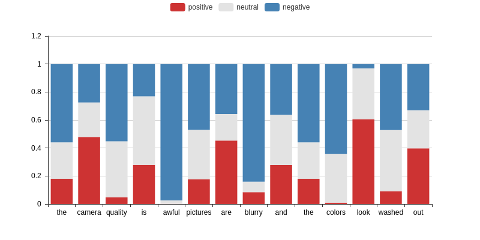
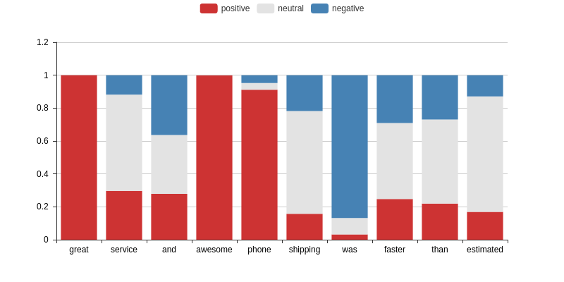

# Innovation

Quantifying the impact of each feature in a text on each sentiment polarity, like follows,the negative words awful and blurry and the positive words great and awesome can be extracted

